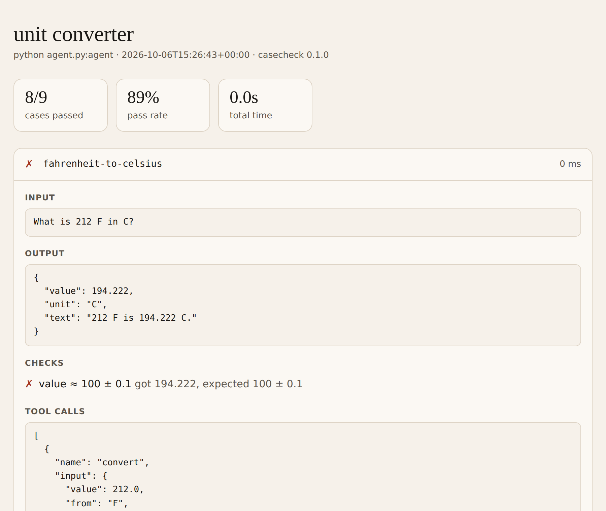

# casecheck

**Test cases for AI agents.** Write cases in a YAML file, run one command, and see which cases pass, why the others failed, and what your last change fixed or broke.

```text
$ casecheck run cases.yaml --no-judge --baseline last
unit converter  python agent.py:agent

  ✓ km-to-miles  0 ms
  ✓ miles-to-km  0 ms
  ✓ kg-to-pounds  0 ms
  ✓ celsius-to-fahrenheit  0 ms
  ✓ fahrenheit-to-celsius fixed  0 ms
  ✓ unknown-unit  0 ms
  ✓ not-a-conversion  0 ms
  ✓ fast-enough  0 ms
  – clear-answer  0 ms  (1 skipped)

  9/9 passed (100%)  in 0.0s

  vs. baseline: 89% → 100%
    fixed: fahrenheit-to-celsius
```

I build agents for a living, and the question I ask most is "did this prompt change make things better, or just different?" A pass rate alone hides that a change can fix three cases and quietly break one. casecheck answers it case by case.



## Install

```bash
pip install "casecheck[judge] @ git+https://github.com/Sharan1712/casecheck"
```

Python 3.10+. Drop `[judge]` if you don't need LLM-graded checks.

## Try it in two minutes

The repo ships a tiny unit-converter agent with one deliberate bug. No API key needed.

```bash
git clone https://github.com/Sharan1712/casecheck && cd casecheck
pip install -e ".[judge]"
cd examples/unit_converter

casecheck run cases.yaml --no-judge          # 8/9 pass: Fahrenheit → Celsius is wrong
# fix the formula in agent.py, then:
casecheck run cases.yaml --no-judge --baseline last --html report.html
```

The second run tells you `fahrenheit-to-celsius` is fixed and writes a single-file HTML report.

## Writing cases

```yaml
name: support agent
target:
  python: agent.py:answer        # a function: answer(input) -> output

cases:
  - id: refund-window
    input: "Can I still return shoes I bought 40 days ago?"
    checks:
      - contains: "30 days"
      - not_contains: ["guarantee", "always"]
      - judge: >
          Says the 30-day return window has passed, offers the exchange
          option, and does not promise a refund.

  - id: order-lookup
    input: { order_id: "A-1042" }
    checks:
      - json_schema:
          type: object
          required: [status, eta]
      - equals: { status: shipped, eta: "2026-10-09" }
      - max_latency_ms: 3000
```

A case passes when all its checks pass. Inputs can be text or any YAML structure.

### Checks

| Check | Passes when |
| --- | --- |
| `equals: X` | the output equals X (text is compared after trimming; structures exactly) |
| `contains: X` / `[X, Y]` | the output contains every item (case-insensitive) |
| `not_contains: X` / `[X, Y]` | the output contains none of them |
| `regex: PATTERN` | the pattern matches somewhere in the output |
| `json_schema: {...}` | the output (or the JSON in it) validates against the schema |
| `number: {equals, tolerance, path}` | a number is within tolerance; `path: a.b.0` digs into structured output, otherwise the first number in the text is used |
| `max_latency_ms: N` | the agent answered within N milliseconds |
| `judge: RUBRIC` | Claude decides the output meets your rubric (see below) |

Add `name:` to any check to give it a friendlier label, and `tags: [...]` to a case to run subsets with `--tag`.

### Targets

```yaml
target:
  python: my_agent.py:run         # or a module path: my_package.agent:run
  # command: python agent.py     # input on stdin, output on stdout
  # http: https://localhost:8000/agent   # POST {"input": ...}, JSON back
  #   (or a mapping with url: and headers:)
```

For `command` and `http` targets, returning JSON shaped like `{"output": ..., "usage": {...}, "tool_calls": [...]}` records the trace.

### Recording a trace

Return a plain value from your agent for the simple case. Return a `Result` to also record token usage, tool calls and anything else worth keeping:

```python
from casecheck import Result


def run(request: str) -> Result:
    response = client.messages.create(...)
    return Result(
        output=response.content[0].text,
        usage={"input_tokens": response.usage.input_tokens, "output_tokens": response.usage.output_tokens},
        tool_calls=[...],
        meta={"prompt_version": "v7"},
    )
```

Usage is summed per run, and every trace shows up in the HTML report.

## The judge

`judge:` checks send the input, the output and your rubric to Claude, which returns a pass/fail verdict with a one-sentence reason. The rubric is a bar, not a score: partly meeting it fails.

- The default model is `claude-opus-5-5` at low effort. Override per suite (`judge: {model: ..., effort: ...}`), per check (`judge: {rubric: ..., model: ...}`) or with `--judge-model`.
- Credentials come from `ANTHROPIC_API_KEY`, `ANTHROPIC_AUTH_TOKEN` or an `ant auth login` profile.
- If the model declines to grade, the request falls back to Anthropic's recommended model automatically. A grade that still can't be produced counts as a failed check with a clear reason, never as a pass.
- `--no-judge` skips judge checks entirely, for fast local loops and CI without secrets.

Keep deterministic checks for anything deterministic. Use the judge for what only a reader can judge: tone, completeness, "doesn't promise a refund".

## Comparing runs and CI

Every run is saved as JSON in `.casecheck/runs/`.

```bash
casecheck run cases.yaml --baseline last          # compare with the previous run of this suite
casecheck run cases.yaml --baseline main.json     # or with a specific run file
casecheck compare old.json new.json               # compare two saved runs
casecheck report run.json -o report.html          # HTML for a saved run
```

Exit codes make it CI-ready:

| Flags | Exit 1 when |
| --- | --- |
| (none) | any case fails |
| `--fail-under 0.9` | the pass rate is below 90% |
| `--no-regressions --baseline last` | any case that passed in the baseline now fails |

Exit code 2 means the suite file itself is invalid.

## Development

```bash
pip install -e ".[dev]"
pytest
ruff check . && ruff format --check .
```

## License

MIT
